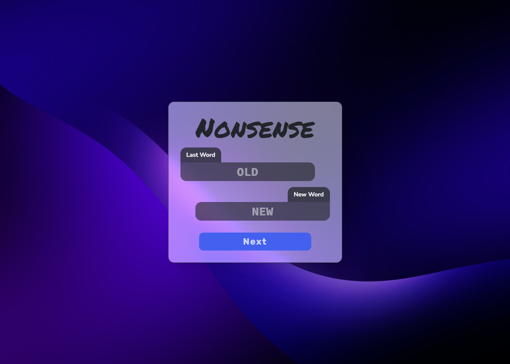

# Nonsense word generator

[](https://app.netlify.com/sites/nonsense-words/deploys)

<br>

## Overview

Generates a nonsense word according to the following rules.

```
1. Each word must be in C-V-C (consonant vowel consonant) format.
2. Words must be written in capital letters.
3. Consonant Q, W, X, Y, Z cannot be used.
4. Consonant H cannot be placed at the end of a word.
5. The first and last letter of a word cannot be the same.
6. Every letter of the current word must be different from the letters of the last word.
7. Letter pair B-V, C-K, G-J cannot appear together. This applies to rule 5 & 6 as well.
8. Every letter of the current word cannot be consecutive to the letters of the last word.
9. Once a vowel is used, the next two vowels cannot be used in the next letter.
```

<br>

## Preview

[](https://nonsense.sounak.dev)
